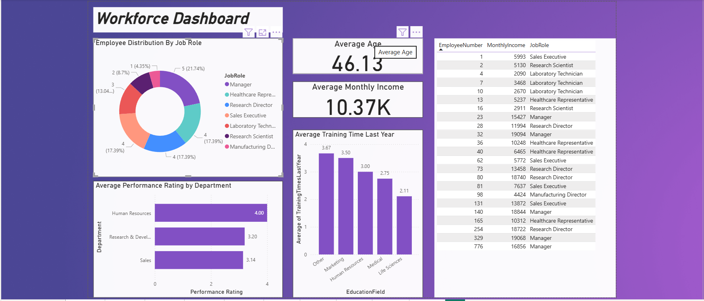
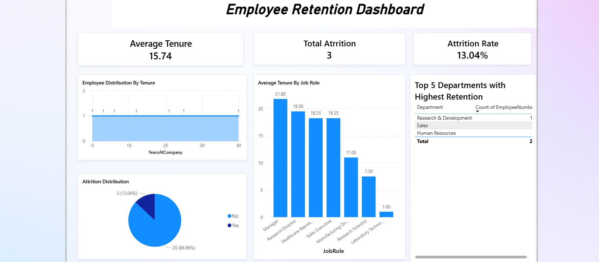
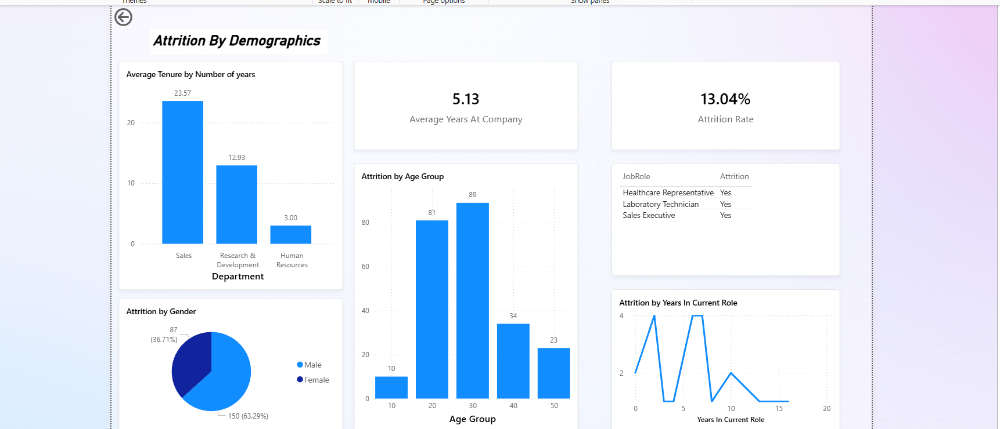

<h1 align="center">📊 Business Analyst Portfolio — Tanushree Angirwal</h1>

  
  
  
  

👋 Hi, I'm Tanushree — an aspiring Business Analyst focused on translating data into clear business decisions.

  <strong>📫 Connect:</strong>
  <a href="https://www.linkedin.com/in/tanushree-angirwal-008344362/">LinkedIn</a> • 
  <a href="mailto:tanushreeangirwal@gmail.com">Email</a>

---

## 📈 Dashboard Gallery

  These dashboards showcase my ability to analyze workforce trends, identify bottlenecks, and deliver business insights through visual storytelling.

---
<table>
  <tr>
    <td align="center">
      <h3>Workforce Dashboard</h3>
      
    </td>
    <td align="center">
      <h3>Employee Retention Dashboard</h3>
      
    </td>
    <td align="center">
      <h3>Attrition Dashboard</h3>
      
    </td>
  </tr>
</table>

---
## 🧾 SQL Scripts
SQL scripts demonstrating joins, aggregations, and KPI logic are stored in `/sql`.

---

## 📁 Documentation
BRDs, FRDs and process documents will appear in `/documentation`.

✨ More projects coming soon — feel free to connect!

---

## 🛠 Tools Used

  
  
  
  

---
